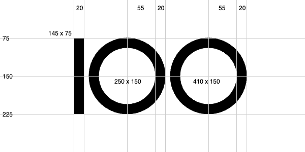
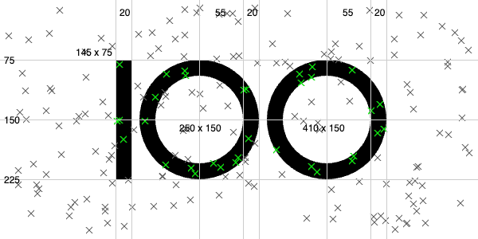

# CODE100 Puzzle - 100 hits!

This time the puzzle is about points in a coordinate system and determining which ones are on a `100` logo.



You get the [following JSON dataset](coordinatesystem.json) of a coordinate system the logo is in with a certain height and width.

```JSON
{
    "width": 600,
    "height": 300,
    "coords": [[480,259],[452,21] … ]
}
```

The `coords` array contains a lot of points (x and y) in this system, and the task is report the amount of overall in-logo points.

Plotted onto the system, this could be something like the following, with the green points being those you should report. 



You don't need to paint them, just find out which ones are on the logo. In this case, it's `33` different points. In the case of the dataset, can you find them?