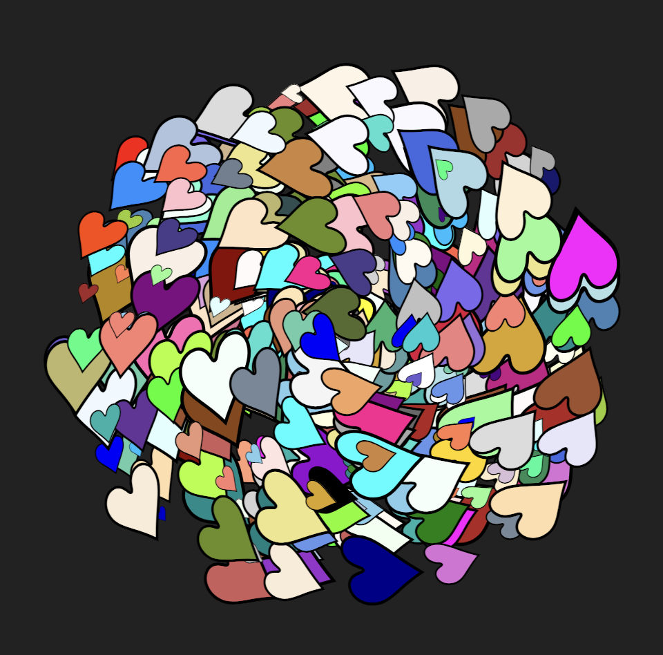

# CODE100 Challenge #BuntStattBraun

In this challenge you get [an HTML document](example.html) that renders a lot of colourful hearts.



And you get a [JSON object](browndata.json) with the information about all the brown colours that were used:

```json
[
    {"name": "Brown", "rgb": "165, 42, 42", "hex": "A52A2A"},
    {"name": "BurlyWood", "rgb": "222, 184, 135", "hex": "DEB887"},
    {"name": "Chocolate", "rgb": "210, 105, 30", "hex": "D2691E"}
    // … and more 
]
```

The task is to find out which of the hearts are in a brown colour and report the overall number and which brown is used how many times.

For example:

```json
{
    "total":12,
    "distribution": {
        "Peru":3,"Chocolate":1,
        "Sienna":1,"Brown":3,
        "BurlyWood":1,
        "SaddleBrown":1
    }
}
```

If you want to solve this in the browser using JavaScript, we also set up a [Codepen](https://codepen.io/codepo8/pen/NWmpJqe).

Let's paint the world!

<!-- details -->
<!-- summary -->
## Solution
<!-- endsummary -->

So, here is the result of the puzzle. 

```json
{
    "amount":20,
    "distribution":{
        "Peru":3,"Chocolate":3,
        "Sienna":5,"Brown":3,
        "BurlyWood":3,"SaddleBrown":3
    }
}
```

The first thing to check is the HTML and see what we need to get to compare to the brown dataset we got. 

```html
<i style=" … color:LightGoldenRodYellow; scale:0.37;">♥</i>
<i style=" …  color:Gray; scale:0.31;">♥</i>
<i style=" …  color:rgb(123, 104, 238); scale:1.17;">♥</i>
<i style=" …  color:#F8F8FF; scale:0.67;">♥</i>
```

The brown data we got has the colors slightly differently. It lacks the `rgb()` or the `#`: 

```json
    {"name": "Sienna", "rgb": "160, 82, 45", "hex": "A0522D" }
```

What we need is the `color` setting of the inline styles which could be a named colour, rgb or hexadecimal. We then need to loop through each of them and compare it to all the brown options. In Node, this could be:

```javascript
// Read the htML and the JSON data
import { readFileSync } from 'fs';
let html = readFileSync('../example.html', 'utf8');
let browndata = JSON.parse(readFileSync('../browndata.json', 'utf8'));

// get all the colours using a regular expression
// matching from `color:` to `;`.
let heartcolours = html.match(/color:(.*?);/gm).map(
    // remove all extra text we don't need
    heart => heart.replace(/color\:|;|rgb\(|\)|#/g,'')
); 
let amount = 0;
let browns = {};
// loop through all the colours we matched
heartcolours.forEach(heart => {
    // loop through all the browns
    browndata.forEach(brown => {
        // and all the possible versions of the colour
        Object.keys(brown).forEach(key => {
            // when they match, increase the overall
            // amount and the named instances
            if (heart === brown[key]) {
                amount++;
                browns[brown.name] = (browns[brown.name] || 0) + 1;
            }
        });
    });
});
let out = {amount: amount, distribution: browns};
console.log(JSON.stringify(out));
```

An in-browser solution using the DOM could be: 

```javascript
// get all the colours from the DOM and remove the extra info
let heartcolours = [...document.querySelectorAll('i')].map(
    i => i.style.color.replace(/rgb\(|\)/g,'')
);
let amount = 0;
let browns = {};
// loop through all colours
heartcolours.forEach(heart => {
    // loop through all browns
    browndata.forEach(brown => {
        Object.keys(brown).forEach(key => {
            let col = brown[key];
            // as the DOM lowercases all named colours
            // we need to change the value of the 
            // named entries
            if (key === 'name') {
                col = col.toLowerCase();
            }
            // when they match, increase the overall
            // amount and the named instances
            if (heart === col) {
                amount++;
                browns[brown.name] = (browns[brown.name] || 0) + 1;
            }
        });
    });
});
let out = {amount: amount, distribution: browns};
console.log(JSON.stringify(out));
```

You can also see this [in the Codepen](https://codepen.io/codepo8/pen/NWmpJqe).

<!-- enddetails -->
