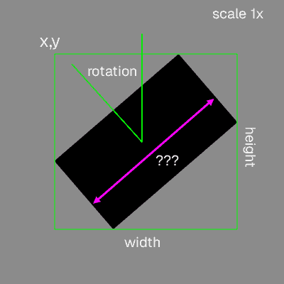

# CODE100 challenge: Charts explosion

Oh dear, we wanted to show you some data insights about the WeAreDevelopers World Congress speaker submissions, but things went very wrong and [our bar charts exploded](boom.html)…

[](boom.html)

Now we call on all you coders, hackers and developers out there to help us recover the data we wanted to show. 
Each bar of the chart has been rotated, moved to a different part of the screen and scaled. 

We were able to analyse the location and other data though. For each bar chart you get the `x` and `y` screen coordinate where its bounding box starts, the angle of the `Rotation` in radians, the `scale` as a factor of 1 and the `width` and `height` in pixels.



All the data you need is in [dataset.csv](dataset.csv) in the format of comma separated values.

```csv
Item,Group,x,y,Width,Height,Rotation,Scale
JavaScript,Languages,239.97,391.67,56.71,29.15,0.28,0.76
Python,Languages,401.44,353.55,59.43,43.76,0.54,0.77
```

Now, what we want you to use your coding skills for is to find the widths of the bars…

Can you tell us: 

* What bar is the biggest?
* What bar is the smallest? 
* What are the averages of each chart (Languages, Tools, Categories, AI topics)?

For example (no, not the real data):

```
Biggest item is JavaScript with 14
Smallest item is Cobol with 2

Averages:
- Languages: 30
- Tools: 23
- Categories: 78
- AI topics: 12
```

Do you have your results? Then why not [apply as a Challenger for the CODE100 in July](https://share.hsforms.com/1Zo4RUx9cTGqbHkq34E-0hQ2a0i0)?