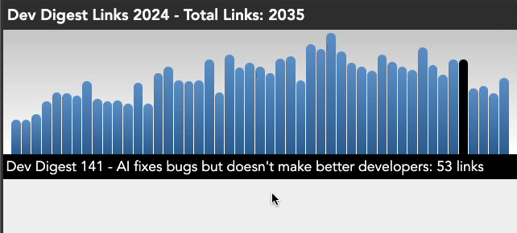

# Dev Digest 2024 barchart challenge

The year is almost over and we released a [weekly newsletter](https://wearedevelopers.com/newsletter) with over 2000 curated links for you to look at. To celebrate, we created [a link archive page](https://devrel.wearedevelopers.com/devdigest2024/) with all the links and [a page to see all the newsletters](https://devrel.wearedevelopers.com/devdigest2024/data.html) and try each link to see just how many are 404 by now.

On the top of the page we have a barchart showing all the newsletters and which have the most links. 



What we want you to do now is re-create this in ASCII. 

You get a [JSON dataset](https://puzzles.code100.dev/puzzles/dev-digest-2024/newsletterarchive2024.json) with the different editions of the newsletter and the links in each:

```json
{
    "total": 2042,
    "97": {
        "title": "Dev Digest #97: Node your average newsletter",
        "links": [
            "www.tpgi.com\/the-top-accessibility-errors-found-in-2023\/",
            "www.levels.fyi\/2023\/",
            "…"
        ]
    },
    "98": {
        "title": "Dev Digest #98: JavaScript's rising stars",
        "links": [
            "risingstars.js.org\/2023\/en",
            "wpt.fyi\/interop-2023",
            "whatpwacando.today\/",
            "…"
        ]
    },
    "99": {
        "title": "Dev Digest #99: almost time for another 100!",
        "links": [
            "go.snyk.io\/202402-ethical-hacking-101-workshop.html",
            "www.developereconomics.net\/",
            "socket.dev\/blog\/2023-npm-retrospective",
            "…"
        ]
    }
}
```

Your job is to create an ASCII barchart showing the amount of links in each newsletter. This should show three editions next to another with number of the Dev Digest followed by the barchart and the amount of links in brackets. The newsletter with the most links should have ten bar characters `█` and the others should be resized accordingly. The newsletters should be in order (the dataset already is).

For example: 

```
097: ██         (15) | 098: ██         (15) | 099: ██         (19)
121: ██████     (47) | 122: ██████     (44) | 087: ███████    (53)
124: ███████    (51) | 125: █████      (41) | 126: ████████   (61)
127: ████████   (56) | 128: ██████████ (88) | 129: ████████   (58)
130: ███████    (48) | 131: ███████    (49) | 132: ██████     (46)
145: █████      (41) | 146: ████       (32) | 
```

You can submit you solutions [using this form](https://forms.gle/2X1Jzdoe91TaoDX98) and we will pick two winners to join us in July in Berlin for the CODE100 final.

<!-- details -->
<!-- summary -->
## Solution 
<!-- endsummary -->

Not here yet, obvs…

<!-- enddetails -->