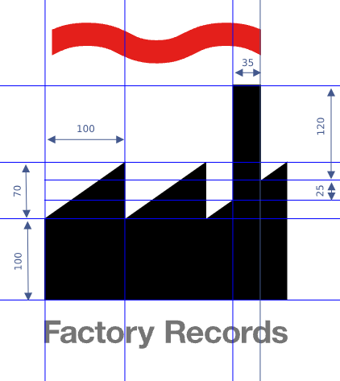

# Factory Records Logo challenge



The challenge is to take the logo of the iconic Factory Records label and return how many black pixels are in when the dimensions are as defined [in this dataset](dataset.json):

```json
{
    "halls": [100,100],
    "chimney": [35,120],
    "connect": [25,25],
    "roofs": [100,70] 
}
```

Return the amount of pixels rounded up to the next full decimal number, like `12123`.
