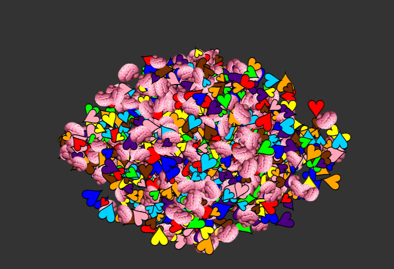

# Hearts and minds challenge

Your job is to [take the HTML document](hearts-and-minds.html) that creates the following design:

And find out the following details:

- How many of the hearts ❤️ and how many of the minds 🧠 are straight?
- "straight" means they point fully up, down, left or right at a straight angle
- How many minds 🧠 are on the left side of the bunch?
- How many hearts ❤️ are on the right side of the bunch?

* [Submit your solution](https://share.hsforms.com/112g51PxHS6mRE9oxgcxdHg2a0i0) to get a chance to be on stage at WeAreDevelopers World Congress 2025!