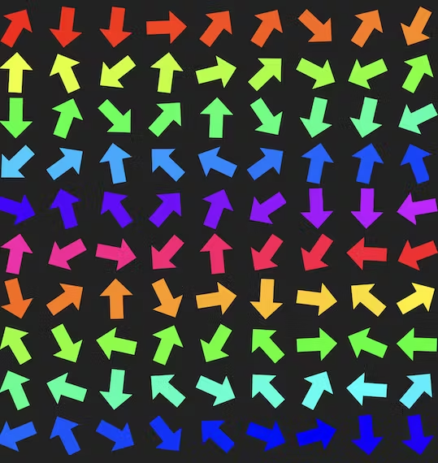

# Challenge: Shift Left challenge

You get a [JSON object](dataset.json) that contains an [HTML document](gridpage.html) that shows a lot of differently coloured arrows:



The HTML is something like this: 

```html
<div class="turngrid">
  <div class="patch" style="color: rgb(255, 238, 0); transform: rotate(200deg);">⬅</div>
  <div class="patch" style="color: rgb(255, 255, 0); transform: rotate(195deg);">⬅</div>
  <div class="patch" style="color: rgb(238, 255, 0); transform: rotate(93deg);">⬅</div>
  <div class="patch" style="color: rgb(221, 255, 0); transform: rotate(66deg);">⬅</div>
<!-- lots more -->
</div>
```

The task is to find all the arrows that point to the right.

Give back the amount of arrows pointing to the right as an integer, f.e. `45`. 

<!-- details -->
<!-- summary -->
## Solution
<!-- endsummary -->

The trick here is to check the rotation values in the CSS transform. An arrow pointing to the left like the one in the HTML `⬅` points to the right when it is rotated between 90 and 270 degrees. 

You can try this out here (click the image to get to [the interactive page](arrow-demo.html)):

[](arrow.demo.html)

Arrows pointing to the left are all colourful and the ones to the right black.

This means all we have to do is to get all the rotations and filter out those whose angle is not larger than 90 or less than 270. In JavaScript, this could be:

```javascript
import { readFileSync, write, writeFile } from 'fs';
const dataset = 'pagedata.json';
const grid = readFileSync(dataset, 'utf8');
let rotations = grid.match(/(\d+)deg/gm)
    .map(rotation => parseInt(rotation, 10)).filter(
            angle => angle > 90 && angle < 270
    );
console.log(rotations.length);
```

<!-- enddetails -->