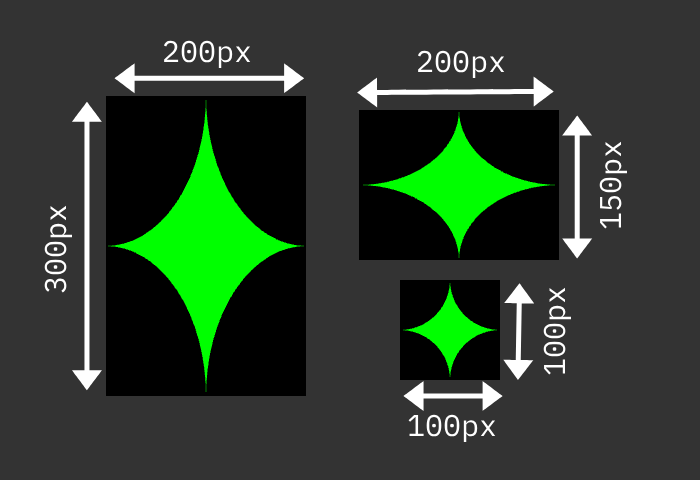
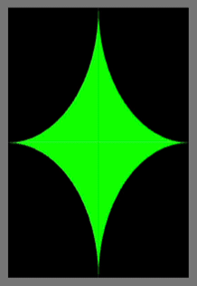

# Stars in their eyes

Your challenge is to return the amount of green pixels in the following image:



He're is a [JSON dataset](stars.json) with the dimensions of each star.

```json
[
    { "width": 200, "height": 300 },
    { "width": 200, "height": 150 },
    { "width": 100, "height": 100 }
]
```

<!-- details -->
<!-- summary -->
## Solution
<!-- endsummary -->

OK, this one was slightly evil. The trick is to not get distracted by the complex shape of the star, but to realise that the black parts of each of them make up an oval or circle as shown in this animation: 



That way you think of the green pixels as a rectangle and the black ones as an oval covering them. 

The amount of green pixels is then the width of the star multiplied by the height minus the area of the oval. 

You can calculate the area of the oval by taking half the width multiplied by half the height and multiply this with PI. 

In JavaScript, using this dataset, this could be: 

```javascript
let pixels = 0;
stardata.forEach(star => {
    pixels += Math.floor(
        star.width * star.height - 
        (Math.PI * star.width/2 * star.height/2)
    );
});
```
Which results in `21460` pixels.

<!-- enddetails -->
