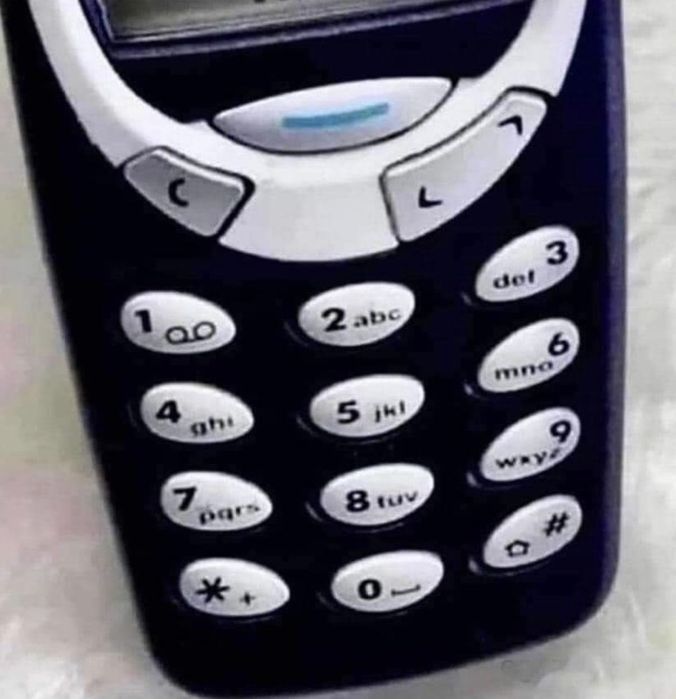

# Thumbs up for the old school

The challenge was the following: 

If `44-33-555-555-666` is `hello` and `9-666-777-555-3` is `world`, what is: 
```
9-33-0-2-777-33-0-3-33-888-33-555-666-7-33-777-7777
```
Can you do an encoder/decoder for this way of writing?

## Solution

What we are dealing with here is the way you texted on old feature phones. Each key represented several characters and you had to press them a few times to type a letter. 



So, to type `a` you would press `2` once, to type `c` you had to pressed `2` three times. To type `o` you pressed `6` three times and so on…

To convert the message here, the first thing to do is to define the keyset as an object:

```Javascript
const keycodes = {
    "0": " ", "2": "abc", "3": "def",
    "4": "ghi", "5": "jkl", "6": "mno",
    "7": "pqrs", "8": "tuv", "9": "wxyz"
};
```

Decoding the message works - for example in JavaScript - the following way:

```javascript
const decode = message => {
    let result = [];
    message.split('-').forEach(item => {
        result.push(keycodes[item[0]][item.length-1]);
    })
    return result.join('');
};
```

* You define an array called `result`.
* You split the message into chunks at the - and loop over them
* This gives you strings like 9, 33, 0, 2, 777…
* You take the first letter of each of those strings (`item[0]`) and use it as they key of the object `keycodes`. You use the `length` of each item to get the right entry in the keyset. 
* So, if the string is `777`, we get the `keyset[7]`, which is `pqrs` and the third item, which is `r`.
* You add that as a new item to the array `result`.
* Once all the chunks are done, you join the `result` array back into a string.

That's all there is to decode the message. Encoding a text into this format is a bit trickier.

```Javascript
const encode = text => {
    return text.split('').map(letter => {
        let str = '';
        Object.keys(keycodes).forEach(key => {
            if (keycodes[key].includes(letter)) {
                str = key.repeat(keycodes[key].indexOf(letter) + 1);
            };
        });
        return str;
    }).join('-');
};
```

* You take the text and split it into single letters.
* You start a new, empty string called `str`
* You loop over all the keys of the keycode object and check if their value includes the letter.
* If it does, you detect where in the value the letter is using `indexOf` and repeat the key value that amount of time. 
* So if the letter is `r`, you detect that it is in the object property `7` as the third letter, which makes `str` the value of `777`. Or `w` would be in the `9` property as the first value, which makes `str` also `9`. 
* You return `str` to override the original chunk of the array that resulted in the split.
* Once all letters are done, you join the splitted array back into a string with a `-` delimiter.

ALl this would have the desired results:

```javascript
console.log(decode('9-33-0-2-777-33-0-3-33-888-33-555-666-7-33-777-7777'))
// = we are developers
console.log(encode('sore thumbs'))
// = 7777-666-777-33-0-8-44-88-6-22-7777
```

We need a delimiter string like - in the code, as, for example `777777` would be ambiguous. Is it `rr` or `qqq` or `ps`?

Did you manage to do it? What was your solution?