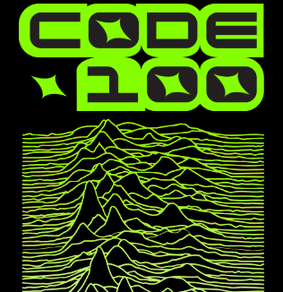

# Unknown pleasures puzzle

To celebrate [CODE100](https://code100.dev) coming to Manchester, here is our take on the classic [Unknown Pleasures by Joy Division cover](unknown.png):

.

You get [a JSON file](pixels.json) with the dimensions of the image and all the pixels with their colours. 

Your job is easy: tell us the amount of black or transparent pixels in the image. Return it as an integer.