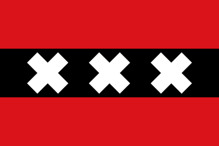

# The CODE100 XXX challenge

It's not what you think… On the 29th of January [CODE100 is coming to Amsterdam](https://code100.dev) - you can [get a ticket here to join the party and network](https://ti.to/wearedevelopers/code100-amsterdam) or you can go the whole hog and [apply as a challenger](https://www.wearedevelopers.com/events/code100-challenger) - remember, the winners get to the finals in July and last year's winner went home with 10,000 Euro prize money.

In any case, this time the puzzle is to celebrate Amsterdam and it's flag:



The challenge is to take a collection of 292 games of noughts and crosses (or Tic Tac Toe) and to find out how many were won by the player using the X like shown in this animation:



You can use [this text file of all the games as the source](games.txt). The file consist of played games separated by a blank line. For example:

```
 O │ O │ O 
───┼───┼───
 X │   │   
───┼───┼───
 X │ X │   

 O │ X │ X 
───┼───┼───
 O │ O │ X 
───┼───┼───
 X │ O │ X 

   │ O │ X 
───┼───┼───
 X │ X │ O 
───┼───┼───
 X │   │ O 
```

In this case, the first game was won by O and the second and third by X. The rules are the ones of the game, in order to win, three Xes must be either in horizontal, vertical or diagonal order. 

How many games were won by X? 

Submit your thoughts and solutions [on this Github gist](https://gist.github.com/codepo8/458953213aae249cdcd4b073e522b4cf).

